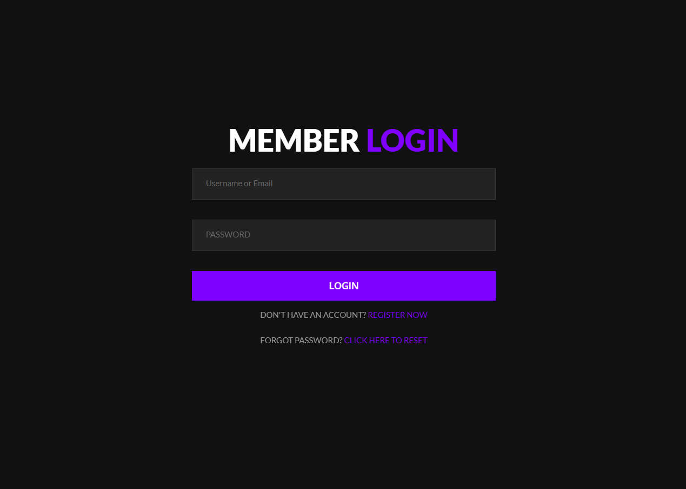

# Lina Ajo - Digital Investment Platform

## What is Lina Ajo?

Nigerian **Ajo** (also called *Esusu* or *Adashe*) is a traditional, trust-based cooperative savings system. Participants pool a fixed amount of money at regular intervals daily, weekly, or monthly  and take turns collecting the entire lump sum, providing a vital tool for business funding, rent, or personal projects.

**Lina Ajo** reimagines this centuries-old system in a secure, modern digital form bringing the spirit of community savings to an online investment platform.

## Features

- 🔐 Secure user registration with email verification
- 💰 Multiple investment plans with flexible durations and return rates
- 📊 Personal dashboard to track earnings and transactions
- 💸 Deposit and withdrawal system
- 👥 Referral program — earn bonuses by inviting others
- 🎁 Welcome bonus credited on account activation
- 🔑 Password reset via email
- 🛡️ Admin dashboard for platform management
- 📱 Mobile responsive design

## Payment Methods

- Cryptocurrency
- Visa / MasterCard
- Bank Transfer

## Screenshots

### Home

### About

### Login

### Properties

### Terms & Service

## Requirements

- PHP 8.0+
- MySQL / MariaDB
- Apache with mod_rewrite enabled (XAMPP recommended for local dev)

## Local Setup

1. Clone the repository into your XAMPP `htdocs` folder
2. Create a database named `lina_ajo` and import `lina_ajo.sql`
3. Create `inc/config.php` using `inc/config.example.php` as a template
4. Rename `_htaccess` to `.htaccess` in the project root
5. Visit `http://localhost/linaajo` in your browser

## Default Admin Account

- **URL:** `/admin`
- **Username:** `admin`
- **Password:** set in `lina_ajo.sql`

> ⚠️ Change the admin password immediately after first login.

## Security Notes

- `inc/config.php` is excluded from version control — never commit it
- All passwords are hashed with `password_hash()` (bcrypt)
- HTTPS redirect available in `.htaccess` — uncomment for production

made with love
